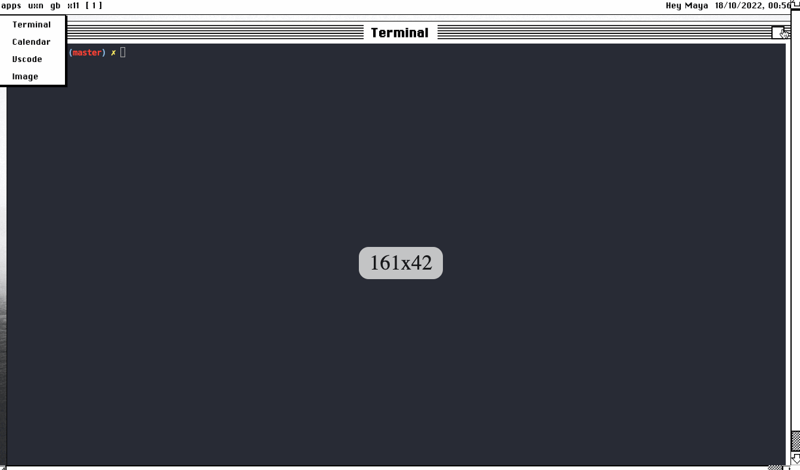
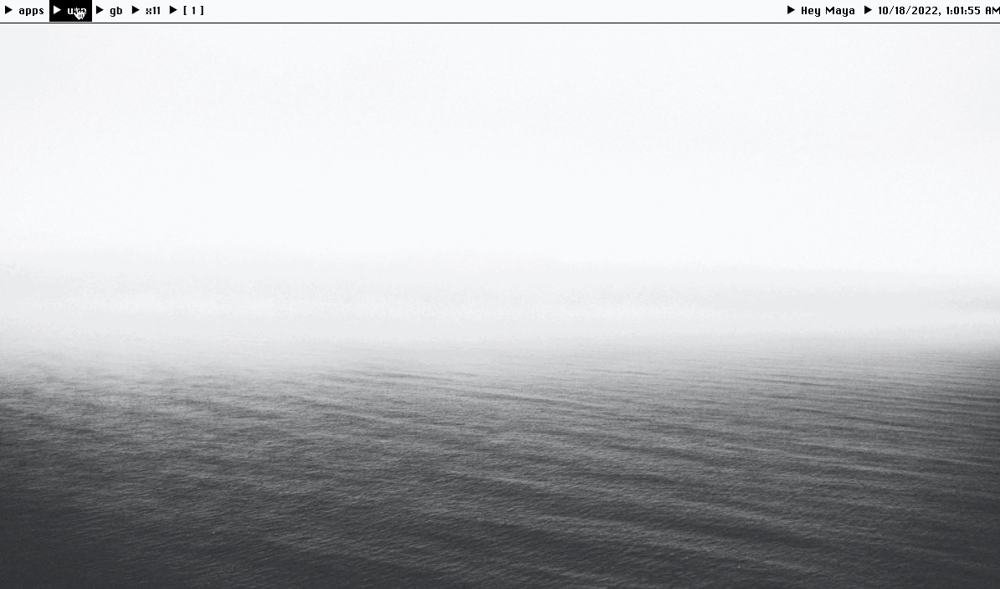
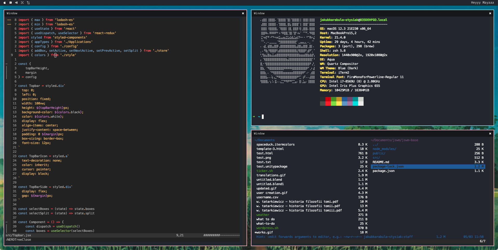

# JSWM

[My post on this project](https://jakubkarabula.github.io/mysite/jswm.html)

## how to add cert and key for https

https://dev.to/josuebustos/https-localhost-for-node-js-1p1k

## TLDR what is jswm

Jswm is an application that can run on a web engine eg a web browser, that creates a virtual window management system. It has support for jswm-"native" apps like 2D image viewing (soon 3D too) but with time I have decided I want to introduce emulators to this app. So far I have added apps that are running with uxn webassembly version, and started some work on bringing gameboy emulator, my big goal is to bring X11 or Wayland emulation and run native Linux apps.

## Story behind it

In my day-to-day job, I am working as a web developer. In most companies in Berlin, that means working on a Mac. This is not too bad, a lot of the terminal tools are available for macOS as well which is great. What is less great is that it's not so easy to replace window manager on the newer versions of macOS, but I don't want to say goodbye to keyboard-driven tiling window managers like i3 and bspwm. There are two main options that I have tried:

- To install for example bspwm one needs XQuartz, it's possible to set it up but then it works only with X11 apps, not native mac ones. I also could not get X11 apps to render properly on retina screens.
- An alternative is to use apps that run alongside standard macOS window managers, things as Amethyst and Yabai. They modify the position and size of the windows, but they don't replace the management so it can be clunky and slow sometimes. I can however recommend Yabai as an ok option for daily use.

[reddit thread on installing bspwm](https://www.reddit.com/r/unixporn/comments/2jkf9z/osx_bspwm_i_cant_get_over_this_integration/clcjjfv/)

An alternative is to use apps that run alongside standard macOS window manager, things like Amethyst and Yabai. They modify the position and size of the windows, but they don't replace the management so it can be clunky and slow sometimes. I can however recommend Yabai as an ok option for daily use.

[amethyst](https://ianyh.com/amethyst/)
[yabai](https://github.com/koekeishiya/yabai)

### This project

I have another idea. It's a bit cursed but it's quite pleasant to work with so far. I spent most of my time working with Firefox, terminal and nvim/vscode, sometimes I need to also take a look at images. And i like keyboard driven flows, tiling window management etc. What if I would be able to have terminal, file management, image viewing etc inside Firefox, just as another tab? This is what I called JSWM, Javascript based window manager that is basically a web app with simple implementations of window management, key bindings and apps like terminal (with ttyd) and image viewing. Most of other things like editing and file browsing I can do via the terminal.

## Presentation

Opening an image from the terminal

Runing uxn piano application

Screenshot

